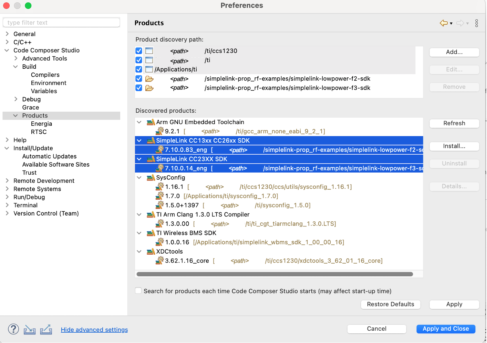

# SimpleLink™ Low Power F2 and F3 ti_wisunfan Examples

This repository contains ti_wisunfan examples for TI devices supported by the
SimpleLink Low Power F2 SDK (LPF2). To learn which devices are supported by the
SDK, refer to the [SDK Device Association section](#sdk-association).

This repository redistributes examples from TI's [SimpleLink LPF2
SDK](https://www.ti.com/tool/download/SIMPLELINK-LOWPOWER-F2-SDK). This SDK is
part of the [SimpleLink Low Power
ecosystem](https://www.ti.com/tool/SIMPLELINK-LOWPOWER-SDK).

More details, including supported devices, IDEs, and toolchains, are provided in
the respective SDK release notes.

## Repository Layout

The **examples/** directory contains the same examples provided in the SDK, in
the same directory structure.

The LPF2 SDK is provided as a [Git
submodule](https://www.git-scm.com/docs/gitsubmodules) in the cc13xx_cc26xx_sdk
subdirectory.

As a quick reference, you can initialize and update a single Git submodule in
one step like this:

```bash
# To initialize and update the LPF2 SDK
.../simplelink-ti_wisunfan-examples$ git submodule update --init cc13xx_cc26xx_sdk
```

Alternatively you can initialize/update _all_ submodules when cloning a repo
with `git clone --recurse-submodules {repo-ref}`. See Git documentation for
details.

Once initialized and updated, you can refer to the SDK's README.md and Release
Notes for details on how to download its dependencies, and build its libraries.

* [SimpleLink LPF2 SDK
  README](https://github.com/TexasInstruments/cc13xx_cc26xx_sdk/blob/main/README.md)

> Note, the links above are to online copies of the latest SDK READMEs. They are
> useful for online readers, but be sure to consult the SDK submodule's _actual_
> README.md after cloning, checking out your branch/tag, and updating your
> submodule, as details may change from release to release.

## Setup Instructions

### Build SDK Libraries

Each time you update an SDK submodule, you will need to build its libraries.
Refer to each SDK's README.md for specifics, but generally you will need to edit
the **imports.mak** file at the top, then run `make`.

## Build Examples

After building the SDK libraries, you can build the ti_wisunfan examples. The
examples support a few ways to build:

* [Command line makefile](#build-examples-from-command-line)
* [CCS IDE](#build-examples-from-ccs)
* [IAR IDE](#build-examples-from-iar)

### Build Examples From Command Line

Remember, before building the examples, you must build the SDK libraries!

To build an example from the command line using [GNU
make](https://www.gnu.org/software/make/manual/make.html), change into the
appropriate example's directory (e.g.
**{rtos}/{board}/ti_wisunfan/{example}/{rtos}/{toolchain}**), then run `make`.

```bash
.../simplelink-ti_wisunfan-examples$ cd examples/rtos/CC1352R1_LAUNCHXL/ti_wisunfan/ns_node/tirtos7/ticlang/
.../ticlang$ make
```

Note, you can also clean the example with `make clean`.

### Build Examples From CCS

Remember, before building the examples, you must build the SDK libraries!

The examples also include TI Code Composer Studio (CCS) project support,
enabling them to be imported into, and built by, CCS.

Before importing the example, the SDK(s) location must be registered with CCS:

1. Preferences->Code Composer Studio->Products
2. Select Add...
3. Navigate to the SDK submodule location
4. Select Open

Repeat for each SDK you will be using. This registers the SDK with CCS.
Successful registration of an SDK will show it in the "Discovered
Products" list:



Now you can import an example!

1. Project->Import CCS Project...
2. Select search-directory->Browse...
3. Navigate to a directory within your clone of the example repo to search for
   examples and Select Folder
4. Select the example(s) you wish to import and press Finish


### Build Examples from IAR

Remember, before building the examples, you must build the SDK libraries!

Follow the instructions in your respective SDK's Quick Start Guide:

* [SimpleLink LPF2 SDK Quick Start Guide](https://dev.ti.com/tirex/explore/node?node=A__AC7UNBWx3i6iMAUzzhqKwA__com.ti.SIMPLELINK_CC13XX_CC26XX_SDK__BSEc4rl__8.30.01.01)

## SDK Association

Click the links below for a list of boards that ti_wisunfan examples are
provided for. Note that TI does not provide boards for every device, so in some
cases you may need to SysConfig-migrate an example from a similar board to your
specific device.

* [SimpleLink LPF2 boards](images/simplelink_cc13xx_cc26xx_sdk.md)
